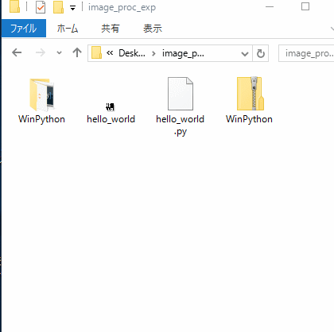
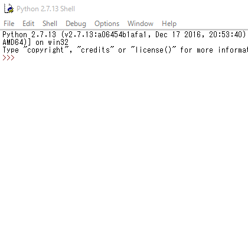
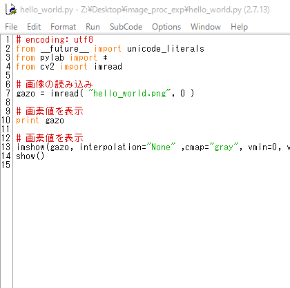
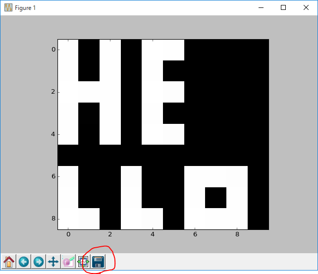
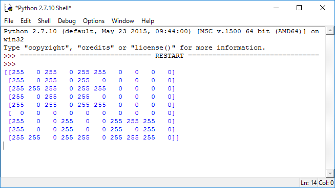
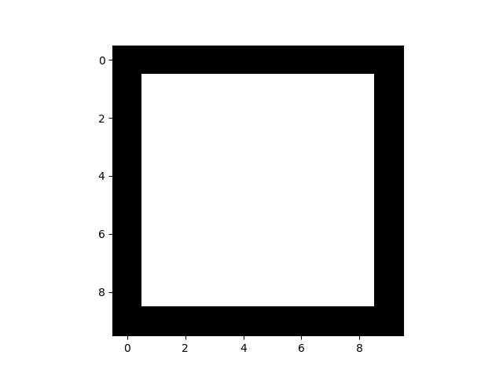
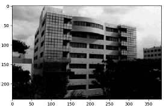

# 画像処理の基礎

目次

- [準備](#準備)
- [練習](#練習)
- [課題の進め方](#課題の進め方)
- [1周目：課題](#1周目課題)
	- [課題1. 画素値と画像の関係](#課題1-画素値と画像の関係)
	- [課題2. 画素位置と画像の関係](#課題2-画素位置と画像の関係)
	- [課題3. 図形の描画](#課題3-図形の描画)
	- [課題4. フィルタ](#課題4-フィルタ)
	- [課題5. ヒストグラムと二値化](#課題5-ヒストグラムと二値化)
	- [課題6. ヒストグラムと階調変換](#課題6-ヒストグラムと色調補正)
- [2周目：課題](#2周目課題)
	- [課題7. 図形の面積の計算](#課題7-図形の面積の計算)
	- [課題8. 図形の輪郭線の長さの計算](#課題8-図形の輪郭線の長さの計算)
- [レポート](#レポート)

## 準備

実験では，Pythonというプログラミング言語を使用します．実験開始前に，[WinPython.zip](https://github.com/naka-tomo/image_proc_exp/blob/master/Python/WinPython.zip?raw=true)からダウンロードし，`右クリック`&rarr;`7-Zip`&rarr;`ここに展開`で展開しなさい．

## 練習

各課題に応じて，ソースコードと画像をダウンロードし，ソースコードを書き換えて実行することになります．以下の手順をよく確認し，何をしているかを理解して，課題へと進みなさい．

1. 以下のソースコードと画像を右クリックメニューの`名前をつけてリンク先を保存`で**同じフォルダ内**に**ファイル名は変更せずに**保存しなさい．
 　[ソースコード](https://raw.githubusercontent.com/naka-tomo/image_proc_exp/master/kadai/hello_world.py)
 　[画像](https://raw.githubusercontent.com/naka-tomo/image_proc_exp/master/kadai/hello_world.png)

1. [準備](#準備)でダウンロードし，展開したフォルダ内の`IDLEX (Python GUI)`をダブルクリックで起動しなさい．IDLEXはPythonのソースコードを編集・実行するためのソフトです． 

1. IDLEXの`File`&rarr;`Open`から，手順1でダウンロードしたソースコード`hello_world.py`を開きなさい．表示されたテキストがプログラムのソースコードです．  

1. IDLEXの`Run`&rarr;`Run Module`によりプログラムを実行できます． 

1. 一方のウィンドウには処理された画像が表示されます．ウィンドウの下側にある保存ボタン（図中の赤丸で囲まれたボタン）を押すと表示されている画像を保存できます．  
もう一方のウィンドウには,プログラム中で*print*関数によって指定された変数の中身が表示されます．このプログラムの場合は，画像の画素値が表示されています．`表示されている文字列を選択`&rarr; `右クリック`&rarr;`Copy`でコピーし，メモ帳などに貼り付けることで保存できます．  

1. 各ウィンドウの右上の☓ボタンでウィンドウを閉じなさい．ウィンドウを閉じないとエラーとなる場合があります．もしエラーが発生したら，全てのウィンドウを閉じて手順2からやりなおしてください．

## 課題の進め方
各課題のソースコードをダウンロードして，ダウンロードしたソースコードを修正し，各課題を行いなさい．ダウンロードは各リンクを右クリックし，`名前をつけてリンク先を保存`で**ファイル名は変えずに同じフォルダ内に**保存しなさい．

各課題で作成したプログラム，生成される画像やprint関数によって表示された文字列は必ず保存し，**必要に応じて**レポートに記載しなさい．また，レポートでは**理論（数式やプログラム）と生成される画像の関係をわかりやすく説明・考察しなさい．**

そのために，講義中にレポートでの**説明・考察が可能な十分な結果**を得られるようにしなさい．

## 1周目：課題

### 課題1. 画素値と画像の関係

[ソースコード](https://raw.githubusercontent.com/naka-tomo/image_proc_exp/master/kadai/kadai1.py)

1. プログラムをダウンロードして実行し，ソースコードを読んで何をしているかを確認しなさい．

1. 代入する値（元のソースコード内では255）を様々に変化させて色の変化を確認しないさい．
 
1. レポートでは，これらの値と生成される画像との対応を説明しなさい．

### 課題2. 画素位置と画像の関係

[ソースコード](https://raw.githubusercontent.com/naka-tomo/image_proc_exp/master/kadai/kadai2.py)

1. プログラムをダウンロードして実行し，ソースコードを読んで何をしているかを確認しなさい．

1. 配列のインデックスの数字（元のソースコード内では3と7)を様々に変えて，これらの数字と画像との対応がどのようになっているか確認しなさい．

1. レポートでは，出力された画像を使って，インデックスと画像との対応をわかりやすく説明しなさい．

### 課題3. 図形の描画

[ソースコード](https://raw.githubusercontent.com/naka-tomo/image_proc_exp/master/kadai/kadai3.py)

1. プログラムをダウンロードして実行し，ソースコードを読んで何をしているかを確認しなさい．

1. ソースコード内の指定された箇所を変更して以下のような白い四角形が描かれた画像を生成しなさい． 

1. レポートでは，作成したプログラムの動作を分かりやすく説明しなさい．

### 課題4. フィルタ

[ソースコード](https://raw.githubusercontent.com/naka-tomo/image_proc_exp/master/kadai/kadai4.py)

[画像](https://raw.githubusercontent.com/naka-tomo/image_proc_exp/master/kadai/kadai4.bmp)

1. ソースコードをダウンロードして実行し，ソースコードを読んで何をしているかを確認しなさい．

1. プログラムを変更しフィルタの値を変え，移動平均フィルタ，ラプラシアンフィルタを実装しなさい．

1.  レポートでは原理（数式・ソースコード）と実行結果（printされる画素値）を照らし合わせて，それらフィルタの処理を分かりやすく説明しなさい．

### 課題5. ヒストグラムと二値化

[ソースコード](https://raw.githubusercontent.com/naka-tomo/image_proc_exp/master/kadai/kadai5.py)

[画像](https://raw.githubusercontent.com/naka-tomo/image_proc_exp/master/kadai/kadai5.bmp)

1. ソースコードをダウンロードして実行し，ソースコードを読んで何をしているかを確認しなさい．

1. プログラムを実行すると表示されるヒストグラムを参照して，画像の特徴を表わす二値画像が生成されるようにプログラムを変更しなさい．．

1. レポートでは，作成したプログラムによってどのような処理が行われているのかを説明しなさい．また，その処理の中で使われている値を選択した理由を，ヒストグラムを使って分かりやすく説明しなさい．

### 課題6. ヒストグラムと階調変換

[ソースコード](https://raw.githubusercontent.com/naka-tomo/image_proc_exp/master/kadai/kadai6.py)

[画像](https://raw.githubusercontent.com/naka-tomo/image_proc_exp/master/kadai/kadai6.bmp)

1. ソースコードをダウンロードして実行し，ソースコードを読んで何をしているかを確認しなさい．

1. プログラムを実行すると表示されるヒストグラムを参照して，以下のような濃淡がよりはっきりとした画像を生成しなさい． 
 

1. レポートでは，作成したプログラムによってどのような処理が行われているのかを説明しなさい．また，その処理の中で使われている値や式を選択した理由を，ヒストグラムを使って分かりやすく説明しなさい．

## 2周目：課題

### 課題7. 図形の面積の計算

[ソースコード](https://raw.githubusercontent.com/naka-tomo/image_proc_exp/master/kadai/kadai7.py)

[画像](https://raw.githubusercontent.com/naka-tomo/image_proc_exp/master/kadai/kadai7.bmp)

1. ダウンロードしたソースコードを改変し，画像中の6つの各図形の面積（画素数）を計算しなさい．

1. レポートでは，作成したプログラムによってどのような処理が行われているのかを分かりやすく説明しなさい．

### 課題8. 図形の輪郭線の長さの計算

[ソースコード](https://raw.githubusercontent.com/naka-tomo/image_proc_exp/master/kadai/kadai8.py)

[画像](https://raw.githubusercontent.com/naka-tomo/image_proc_exp/master/kadai/kadai8.bmp)

1. ダウンロードしたソースコードを改変し，画像中の6つの各図形の輪郭線の長さを計算しなさい．

1. レポートでは，作成したプログラムによってどのような処理が行われているのかを分かりやすく説明しなさい．

## レポート

レポートには以下の内容を含めること．

- **表紙**
タイトル・実験グループ・学籍番号・名前・実験日を記載する．

- **目的**
実験全体の目的を簡潔に書く．

- **理論**
実験内で用いた理論を数式を用いて説明する．

- 以下，各課題ごとに記述する．
	- **実験方法**
    ソースコードと使用した画像を記載し，各課題ごとに何が目的で，その目的を達成するためにどのような方法を使用したのかを記載する．ただし，ソースコードは重要な箇所を抜粋して記載すること．また，ソフトウェア(PythonやIDLEX)の使い方を記載する必要はなく，他のプログラミング言語であっても，本実験を再現可能な情報を書くこと．
	- **実験結果・考察**
	実行結果の画像と，必要であればprint文で表示された内容を記載し，**なぜ** そのような結果となったのかを，数式・ソースコード・実験結果を照らし合わせてわかりやすく説明する．
    
- **結論**
実験の目的，行ったことを完結にまとめ，結論として何が得られたのかを説明する．

- **感想**

レポートは*PDF*に変換しメールにて提出．
- 宛先：naka.class+exp18(あっと)gmail.com
このアドレスにメールを送ると，数分以内に自動返信メールが送信されます．自動返信メールが届かない場合には，メールアドレスが間違っている可能性があるので，確認してください．

- タイトル：画像処理の基礎レポート

- 本文：学籍番号・名前・実験日を必ず記載する

- 提出期限：次回実験日前日の23時59分

- 再提出通知：
提出した翌週の月曜の23時59分までにメールで返信します．
なおメールに返信がなかった場合には，レポートは受理となります．
